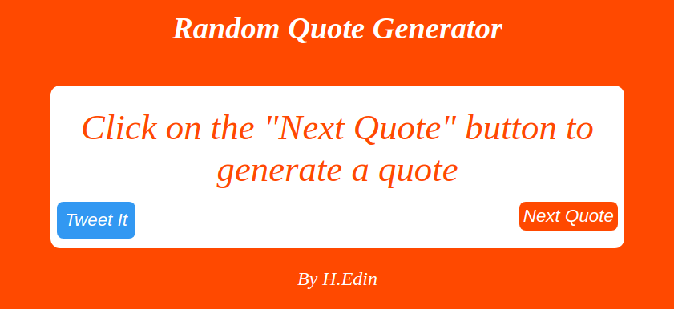

# Random Quote Generator

## This project if part of the [gomycode](https://gomycode.tn) fullstack JS cursus.

## This website is responsive.

## User Stories

1. <strong>User Story:</strong> The user can view new random quotes on the screen by clicking on the 'next quote' button.

2. <strong>User Story:</strong> The user can tweet the generated quote by clicking on the tweet button. When the latter is clicked, a new tab is opened leading to the twitter website with the quote and the quote's author both in the input's container, ready to be posted.

	

# What did I learn:

1. DOM manipulation according to the user's interaction.

2. Structure my work into functions.

3. How to name your variables and functions relevant names..

4. Responsive Design using media query.
